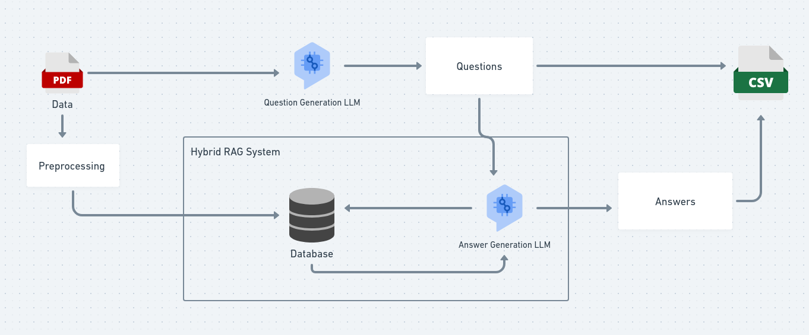
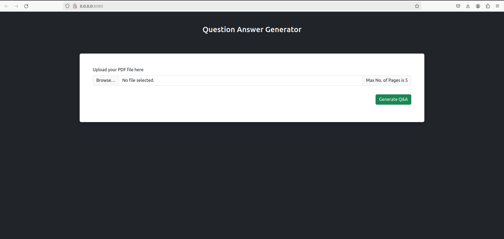
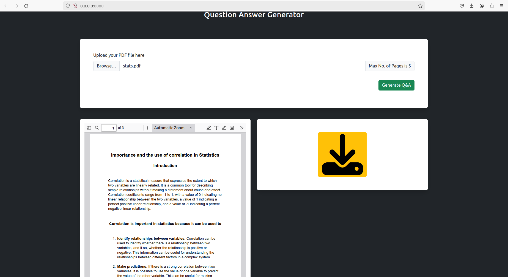

# QAGenerator

### Project Overview

This project aims to develop question and answers from the given PDF file. It uses the pdf file to generate questions using LLM (in this case llama3) and then using Hybrid RAG (keyword search + vector search)system to generate answers for the generated questions. 



### How to Run ?

1. Create an environment

```bash
conda create -p venv_qag python=3.9 -y

conda activate ./venv_qag
```

2. Install Requirements

```bash
pip install -r requirements.txt
```

3. Create .env file with GROQ_API_KEY and COHERE_API_KEY

4. Run the app.py file

```bash
python app.py
```

### App Preview




